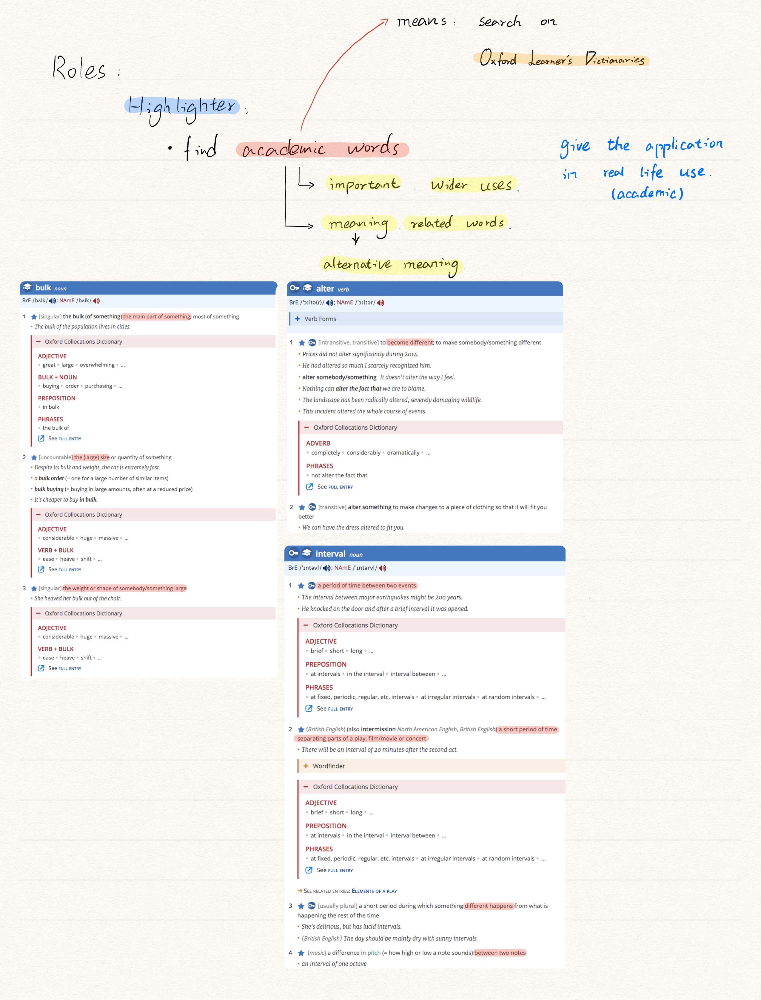
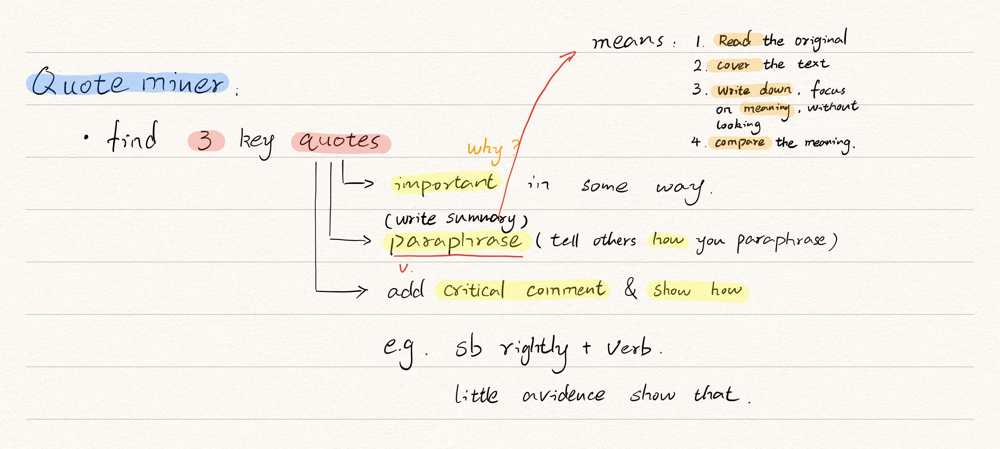

# Different Roles

There are 6 roles in Academic Reading Circles(ARC).

## Leader

*   Prepare and ask question to check the main ideas
*   Use the text structure to organise the discussion
*   Ensure all students have the chance to speak
*   Ask general, topic-related question at the end

!!! tip "Summary"
    Controls **discussion** and analyses text **structure**

## Summarisor

*   Summarise the main points of each section
*   Identify main points examples, analysis and links

!!! tip "Summary"
    Identifies **main points** and **key ideas** in text

## Connector

*   Connect information in the text to the wider world

!!! tip "Summary"
    Create **links** to **information** in the **wider world**

## Contexture

*   Identify, research and explain contextual information within the text

!!! tip "Summary"
    **Researches** information around the text

## Highlighter

*   Identify key academic words in the text
*   Research their meanings and related words

!!! tip "Summary"
    Identifies key **academic words** in the text

## Visualiser

*   Identify key concepts in the text
*   Represent them in visual form

!!! tip "Summary"
    Represent **key concepts** in **visual form**

## Example

