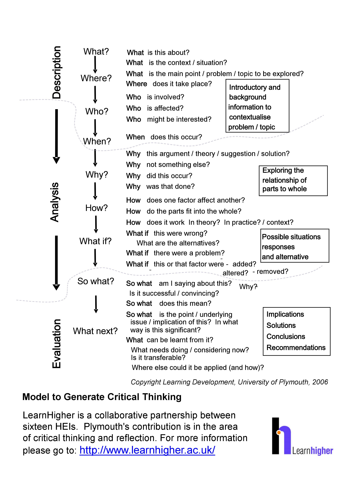

# Critical Thinking

# Essay / Paragraph Structure Model

## **<u>Introduction</u>**

* General background information on the topic, e.g. facts/importance of the topic, definitions, rewording/expansion of the question.
* **<u>Thesis Statement</u>**: direction of argument and how topic will be subdivided.

>## **<u>Paragraph 1</u>**
>* **<u>Topic Sentence</u>**
>* Support idea 1
>* Evidence/Example/Analysis for support idea 1
>* Support idea 2
>* Evidence/Example/Analysis for support idea 2
>* Paragraph conclusion (optional)

>## **<u>Paragraph 2</u>**
>* **<u>Topic Sentence</u>**
>* Support idea 1
>* Evidence/Example/Analysis for support idea 1
>* Support idea 2
>* Evidence/Example/Analysis for support idea 2
>* Paragraph conclusion (optional)

>## **<u>Paragraph 3</u>**
>* **<u>Topic Sentence</u>**
>* Support idea 1
>* Evidence/Example/Analysis for support idea 1
>* Support idea 2
>* Evidence/Example/Analysis for support idea 2
>* Paragraph conclusion (optional)

# Introduction Triangle

# Conclusion Triangle 

# Paraphrasing and Summarizing

!!! tip "Learning Outcomes"
    * Construct appropriate paraphrases and summaries of a source text using different techniques.
    * Avoid plagiarism based on the above.
    * Evaluate the quality of a paraphrase.

In academic writing, you must be able to understand information from a source text and use it to support your view/argument.
    
* Paraphrasing is writing the ideas of another person in your own words.
* A summary is a shortened version of a text written by another person. It contains the main points in the text and is written in your own words (paraphrase).
* A quotation or quote is an exact copy of a short piece of text written by another person. It is used to support your ideas/statements in your writing. Use sparingly: your writing should be mainly your own words.
* All three require citation.

*Adapted from Gillet, A. (2018) "Academic writing: reporting." Using English for Academic Purposes For Students in Higher Education [online]* 

# Master Chart of Transition Signals

The following chart lists the transition signals.

  <table width="100%">
    <tr>
      <td>
        <b>
          Sentence 
          Connectors
        </b>
      </td>
      <td>
        <b>
          Coordinating 
          Conjunctions
        </b>
      </td>
      <td>
        <b>
          Subordinating 
          Conjunctions
        </b>
      </td>
      <td>
        <b>
          Others
        </b>
      </td>
    </tr>
    <tr></tr>
    <tr>
      <td align="center" colspan="4">
        <b>To list ideas in time order</b>
      </td>
    </tr>
    <tr>
      <td>
        First, Second, 
        First of all, 
        Next, 
        Meanwhile, 
        After that, 
        Finally, 
        Now 
        Soon 
        Then
      </td>
      <td></td>
      <td>
        after 
        as 
        as soon as 
        before 
        since 
        until 
        when 
        whenever 
        while
      </td>
      <td>
        At last, 
        At 12:00, 
        After a while, 
        Before beginning the lesson, 
        In the morning, 
        The next day, 
        The first step... 
        The second step... 
        After five minutes, 
      </td>
    </tr>
    <tr>
      <td align="center" colspan="4">
        <b>To list ideas in logical division of ideas order</b>
      </td>
    </tr>
    <tr>
      <td>
        First, Second, etc. 
        First of all, 
        Furthermore, 
        Also, 
        In addition, 
        Moreover,
      </td>
      <td>and</td>
      <td></td>
      <td>
        A second (reason, kind, advantage, etc.)... 
        An additional (reason, kind, advantage, etc.)... 
        The final (reason, kind, advantage, etc.)...
      </td>
    </tr>
    <tr>
      <td align="center" colspan="4">
        <b>To add a similar idea</b>
      </td>
    </tr>
    <tr>
      <td>
        Similarly, 
        Likewise, 
        Also, 
        Furthermore, 
        In addition, 
        Moreover,
      </td>
      <td>
        and  
        (Paired conjunctions) 
        both ... and 
        not only ... but also
      </td>
      <td></td>
      <td></td>
    </tr>
    <tr>
      <td align="center" colspan="4">
        <b>To make a comparision</b>
      </td>
    </tr>
    <tr>
      <td>
        Similarly, 
        Likewise, 
        Also, 
        too
      </td>
      <td>
        and ... (too)  
        (Paired conjunctions) 
        both ... and 
        not only ... but also
      </td>
      <td>(just) as</td>
      <td>
        similar (to) 
        equal (to) 
        equally 
        the same (as) 
        (just) like
      </td>
    </tr>
    <tr>
      <td align="center" colspan="4">
        <b>To add an opposite idea</b>
      </td>
    </tr>
    <tr>
      <td>
        On the other hand, 
        However,
      </td>
      <td>
        but 
        yet
      </td>
      <td></td>
      <td></td>
    </tr>
    <tr>
      <td align="center" colspan="4">
        <b>To make a contrast</b>
      </td>
    </tr>
    <tr>
      <td>
        On the other hand, 
        However, 
        In contrast,
      </td>
      <td>
        but 
        yet
      </td>
      <td>
        while 
        whereas 
        although 
        though 
        even though
      </td>
      <td>
        different (from) 
        differently 
        unlike 
        differ (from) (in)
      </td>
    </tr>
    <tr>
      <td align="center" colspan="4">
        <b>To give an example</b>
      </td>
    </tr>
    <tr>
      <td>
        For example, 
        For instance,
      </td>
      <td></td>
      <td></td>
      <td>
        such as ... 
        An example of ...
      </td>
    </tr>
    <tr>
      <td align="center" colspan="4">
        <b>To give a reason</b>
      </td>
    </tr>
    <tr>
      <td></td>
      <td>for</td>
      <td>
        because 
        since 
        as
      </td>
      <td>because of (+noun)</td>
    </tr>
    <tr>
      <td align="center" colspan="4">
        <b>To give a result</b>
      </td>
    </tr>
    <tr>
      <td>
        Therefore, 
        Thus, 
        Consequently, 
        As a result,
      </td>
      <td>so</td>
      <td></td>
      <td></td>
    </tr>
    <tr>
      <td align="center" colspan="4">
        <b>To add a conclusion</b>
      </td>
    </tr>
    <tr>
      <td>
        All in all, 
        For these reasons, 
        In brief, 
        In conclusion, 
        Indeed, 
        In short, 
        In summary, 
        To conclude, 
        To summarize, 
        To sum up,
      </td>
      <td></td>
      <td></td>
      <td>
        It is clear that ... 
        These examples show that ... 
        You can see that ... 
        You can see from these examples that ...
      </td>
    </tr>
  </table>