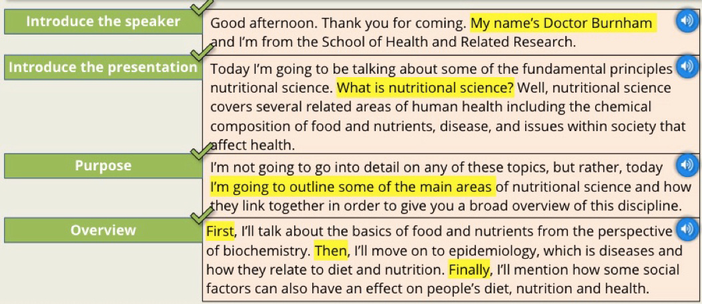

# Presensation Stages

## Overview

**Stage 1: Introduce the speaker**

The speaker greets the audience, introduces him and states the overall purpose.

**Stage 2: Introduce the presentation**

The speaker tells the audience what he intend to talk about, i.e. listening the different sections of the presentation.

**Stage 3: Main body**

The speaker talks about the presentation topic in detail.

**Stage 4: Conclusion"**

The speaker lets the audience know that he is going to finish the presentation.

**Stage 5: Question / Discussion"**

The speaker gives the audience the opportunity to ask question.

**Example:**

## Stage 1: Introduce the speaker
* Greet the audience
* Introduce yourself
* Introduce the presentation topics

**Example:**

* Good morning my name's […] and today I'm going to be talking about nuclear energy.

* Hello every. If you don't know me, my name's […] and my presentation is about marketing strategies.

* Hello, I'd like to begin by introducing my self. I'm […] and today I'm going to tell you about climate change.

## Stage 2: Introduce the presentation
* Define key terms
* Give an overview of the presentation

**Example:**

1. I'll begin by giving a definition of the concept of ...

2. Then, I'll go on talk about the different parts of ...

3. In the next section, I'll aim to describe the ...

4. And finally, I'll finish off with some recommendations and suggestions for further research on ...

!!! tip
    **Important:** Help the audience to understand the structure.

## Stage 3: Main body

## Stage 4: Conclusion

## Stage 5: Question / Discussion